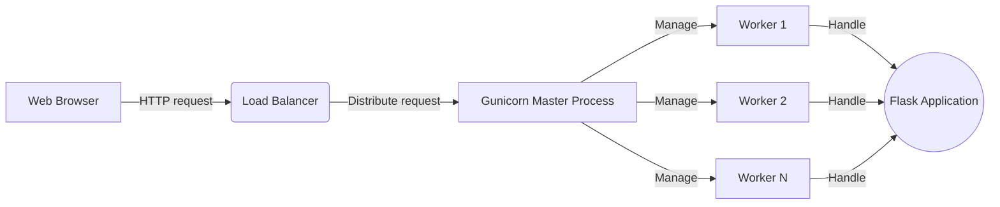

# Gunicorn Deployment Guide for Flask

This guide outlines how to deploy the `gigyeah-ai-engine` Flask application using Gunicorn, a Python WSGI HTTP Server for UNIX, providing a robust option for production environments.

## Why Gunicorn?

Gunicorn serves as an intermediary between your Flask application and the web, handling HTTP requests and managing worker processes to scale your application efficiently.

## Setup Gunicorn

Ensure you're within the project's root directory and the virtual environment is activated.

### Install Gunicorn

If not already added to your `pyproject.toml`, install Gunicorn using Poetry:

```shell
poetry add gunicorn
```

### Run Flask App with Gunicorn

Navigate to the root of your project, ensuring your `FLASK_APP` environment variable is correctly set in your `.env` file or your shell session:

```shell
export FLASK_APP=src/gigyeah_ai_engine:create_app()
```

Run the application using Gunicorn from the project root. Adjust the command based on your project structure:

```shell
poetry run gunicorn --chdir src "gigyeah_ai_engine:create_app()"
```

## Deployment Diagram



## Scaling with Workers

Gunicorn allows you to scale your application by running multiple worker processes. Determine the number of worker processes based on your server's CPU cores. As a general rule, `2-4 x NumCores` workers are recommended for optimal performance.

To specify the number of worker processes, use the `-w` or `--workers` flag:

```shell
poetry run gunicorn --chdir src -w 4 "gigyeah_ai_engine:create_app()"
```

## Common Errors and Solutions

### Bind Error

**Symptom:** Gunicorn fails to start due to a bind error (e.g., address already in use).

**Solution:** Ensure no other processes are using the same port. Alternatively, specify a different port using the `-b` flag:

```shell
poetry run gunicorn --chdir src -b 0.0.0.0:8080 "gigyeah_ai_engine:create_app()"
```

### Worker Timeout

**Symptom:** Workers timing out, especially under heavy load.

**Solution:** Increase the timeout value with the `--timeout` flag, or optimize your Flask application to handle requests more efficiently.

```shell
poetry run gunicorn --chdir src --timeout 120 "gigyeah_ai_engine:create_app()"
```

Following this guide and adjusting the configurations as necessary for your deployment environment will help you successfully deploy your Flask application with Gunicorn.
